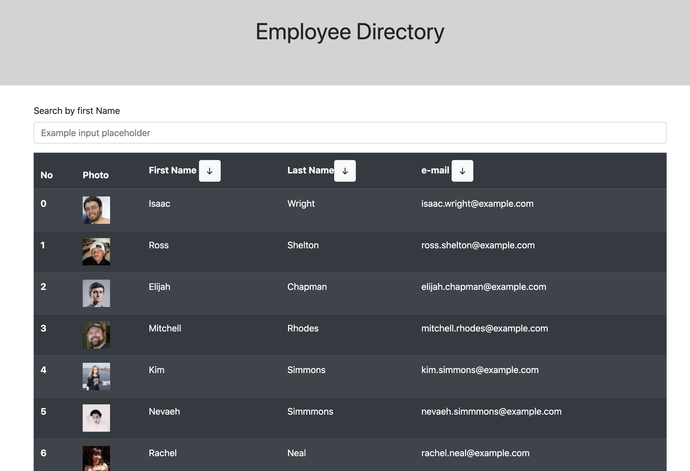

# H18 - EMPLOYEE DIRECTORY

Welcome Employee Directory

## Summary

This application will allow you to se a Employee Directory, sort the result by First Name, Last Name, e-mail.  Also I will allow you to filter records by First Nmae

## GettingStarted

Project Location

>[Project's GitHub repository](https://github.com/crisdc88/H18-employee-directory)

## Prerequisites

>NA

## Built With

>* Node js
>* React
>* HTML
>* CSS

## Installation

If you want to download this project follow these steps.

To run this application on your local machine follow these steps:

>1. Clone project from github.
>2. Copy sql statements found in db/query.sql and run the statements on your mySQL application.
>3. Open the terminal and go to the project's path
>4. run command: npm install
>5. run command: npm start

## Deployed Link

>

## Code-Snippets

The following snippet shows the use of Hooks.  In this case 4 type of states were implemented.  

1. The employee hook to manage the emloyee array and render the employee list every time there's a change.

2. The Search Hook to manage the search filter so every time there's an input the employee list will change to show only the employees that have thos characters in their name.

3. The toggle hook, so only when there's a change on the search form the setEmployee get's called.

```sh
    const [employeeCopy, setEmployeeCopy] = useState([]);
    const [employees, setEmployees] = useState([]);
    const [search, setSearch] = useState({})
    const [toggle, setToggle] = useState(false)


    useEffect(() => {

        if (employees.length === 0) {
            API.getDirectory(100).then((res) => {
                console.log(res)
                setEmployees(res.data.results)
                setEmployeeCopy(res.data.results)
            })
        }
        if (toggle) {
            console.log("toggle true")
            let tempEmployee = [...employeeCopy].filter(item => { return item.name.first.toLowerCase().indexOf(search.searchName) > -1 })
            setEmployees(tempEmployee)
            console.log(tempEmployee)
            setToggle(false);
        }


    }, [employees, toggle])


```

## Screen shots / gifs




## Author


D. Cristina Terry

GitHub: [https://github.com/crisdc88/](https://github.com/crisdc88/),

LinkedIn: [www.linkedin.com/in/dcristinaterry](www.linkedin.com/in/dcristinaterry)

## License


